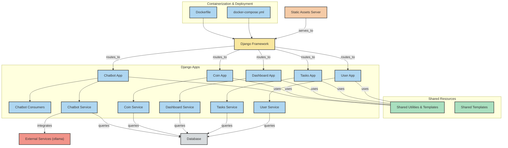

# Django + htmX example

```mermaid
flowchart TD
    %% Containerization & Deployment
    subgraph "Containerization & Deployment"
        DF["Dockerfile"]:::deploy
        DC["docker-compose.yml"]:::deploy
    end

    %% Core Web Server
    DjangoFramework["Django Framework"]:::backend

    %% Shared Resources
    subgraph "Shared Resources"
        SharedUtils["Shared Utilities & Templates"]:::shared
        SharedTemplates["Shared Templates"]:::shared
    end

    %% Static Assets
    StaticServer["Static Assets Server"]:::static

    %% Django Apps
    subgraph "Django Apps"
        ChatbotApp["Chatbot App"]:::app
        ChatbotConsumers["Chatbot Consumers"]:::app
        ChatbotService["Chatbot Service"]:::app

        CoinApp["Coin App"]:::app
        CoinService["Coin Service"]:::app

        DashboardApp["Dashboard App"]:::app
        DashboardService["Dashboard Service"]:::app

        TasksApp["Tasks App"]:::app
        TasksService["Tasks Service"]:::app

        UserApp["User App"]:::app
        UserService["User Service"]:::app
    end

    %% Database
    DB["Database"]:::db

    %% External Services
    External["External Services (ollama)"]:::external

    %% Interactions
    DF --> DjangoFramework
    DC --> DjangoFramework

    DjangoFramework -->|"routes_to"| ChatbotApp
    DjangoFramework -->|"routes_to"| CoinApp
    DjangoFramework -->|"routes_to"| DashboardApp
    DjangoFramework -->|"routes_to"| TasksApp
    DjangoFramework -->|"routes_to"| UserApp

    ChatbotApp --> ChatbotConsumers
    ChatbotApp --> ChatbotService
    ChatbotService -->|"integrates"| External

    CoinApp --> CoinService
    DashboardApp --> DashboardService
    TasksApp --> TasksService
    UserApp --> UserService

    ChatbotApp ---|"uses"| SharedUtils
    CoinApp ---|"uses"| SharedUtils
    DashboardApp ---|"uses"| SharedUtils
    TasksApp ---|"uses"| SharedUtils
    UserApp ---|"uses"| SharedUtils

    StaticServer -->|"serves_to"| DjangoFramework

    ChatbotService -->|"queries"| DB
    CoinService -->|"queries"| DB
    DashboardService -->|"queries"| DB
    TasksService -->|"queries"| DB
    UserService -->|"queries"| DB

    %% Click Events
    click DjangoFramework "https://github.com/secrett2633/django-htmx/blob/main/mytodo/manage.py"
    click DjangoFramework "https://github.com/secrett2633/django-htmx/blob/main/mytodo/shared/settings.py"
    click DjangoFramework "https://github.com/secrett2633/django-htmx/blob/main/mytodo/shared/asgi.py"
    click DjangoFramework "https://github.com/secrett2633/django-htmx/blob/main/mytodo/shared/wsgi.py"

    click ChatbotApp "https://github.com/secrett2633/django-htmx/tree/main/mytodo/chatbot/"
    click ChatbotConsumers "https://github.com/secrett2633/django-htmx/blob/main/mytodo/chatbot/consumers.py"
    click ChatbotService "https://github.com/secrett2633/django-htmx/tree/main/mytodo/chatbot/service/"

    click CoinApp "https://github.com/secrett2633/django-htmx/tree/main/mytodo/coin/"
    click CoinService "https://github.com/secrett2633/django-htmx/tree/main/mytodo/coin/service/"

    click DashboardApp "https://github.com/secrett2633/django-htmx/tree/main/mytodo/dashboard/"
    click DashboardService "https://github.com/secrett2633/django-htmx/tree/main/mytodo/dashboard/service/"

    click TasksApp "https://github.com/secrett2633/django-htmx/tree/main/mytodo/tasks/"
    click TasksService "https://github.com/secrett2633/django-htmx/tree/main/mytodo/tasks/service/"

    click UserApp "https://github.com/secrett2633/django-htmx/tree/main/mytodo/user/"
    click UserService "https://github.com/secrett2633/django-htmx/tree/main/mytodo/user/service/"

    click SharedUtils "https://github.com/secrett2633/django-htmx/tree/main/mytodo/shared/"
    click SharedTemplates "https://github.com/secrett2633/django-htmx/tree/main/mytodo/shared/templates/shared/"

    click StaticServer "https://github.com/secrett2633/django-htmx/tree/main/mytodo/static/"

    click DF "https://github.com/secrett2633/django-htmx/tree/main/Dockerfile"
    click DC "https://github.com/secrett2633/django-htmx/blob/main/docker-compose.yml"

    click External "https://github.com/secrett2633/django-htmx/blob/main/mytodo/chatbot/service/ollama.py"

    %% Styles
    classDef backend fill:#F9E79F,stroke:#333,stroke-width:2px;
    classDef app fill:#AED6F1,stroke:#333,stroke-width:2px;
    classDef shared fill:#A9DFBF,stroke:#333,stroke-width:2px;
    classDef static fill:#F5CBA7,stroke:#333,stroke-width:2px;
    classDef db fill:#D7DBDD,stroke:#333,stroke-width:2px;
    classDef external fill:#F1948A,stroke:#333,stroke-width:2px;
    classDef deploy fill:#AED6F1,stroke:#333,stroke-width:2px;
```
